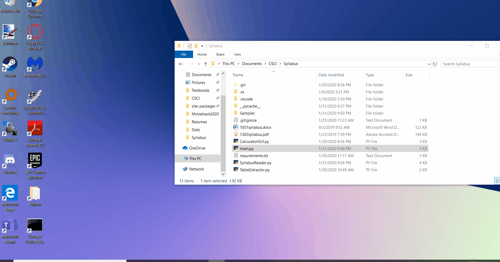

# Syllabus Calc

A script that creates a weighted grade calculator by parsing a syllabus. Made with Python, Regex, and NLTK. Syllabi in the form of PDF, html, and docx files are supported. Table parsing is supported for PDF and html files.

## Usage
After installing requirements, run main.py. Select the folder with the syllabi and indicate if the grading information is in a table for more accurate results.

## Notes
This was a personal project built over Winter Break to practice language processing.
